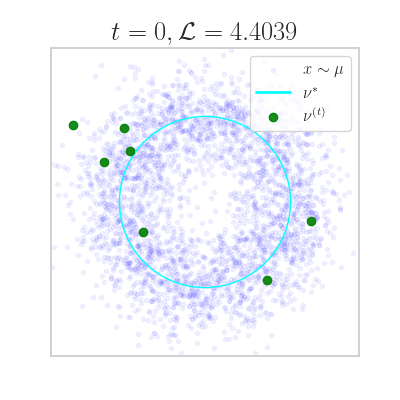

# About

This repo contains the data and code in the paper
[Estimating the Rate-Distortion Function by Wasserstein Gradient Descent](https://arxiv.org/abs/2310.18908), NeurIPS 2023.

In this work, we apply ideas and techniques from optimal transport to better solve the problem of estimating
the rate-distortion function, a fundamental quantity in information theory that
characterizes the fundamental compressibility of a given data distribution.

For an introduction to this topic, see this blog post: [part 1](https://yiboyang.com/posts/estimating-the-rate-distortion-function-of-real-world-data-part-1/), [part 2](https://yiboyang.com/posts/estimating-the-rate-distortion-function-of-real-world-data-part-2/).

**UPDATE [Nov 1, 2023]** Added WGD (demo [here](notebooks/wgd_demo.ipynb)), its hybrid variant (demo [here](notebooks/hybrid_demo.ipynb)) and Blahut--Arimoto.

# Software
Run `pip install -r requirements.txt` in a Python environment with Python 3.10 or above. The main dependencies are jax and tensorflow.
Update 'project_dir' in `proj_configs.py` to point to the present directory. This is the "project root" directory.

The code is structured such that 
 - `common` contains common utility/boilerplate plate code for train/eval;
 - `ba` implements Blahut--Arimoto (with random discretization);
 - `bagd` implements the proposed WGD algorithm on the rate (BA) functional;
 - `bahybrid` implements the proposed hybrid algorithm on the rate (BA) functional;
 - more to come...

# Experiments
We keep all the hyperparameter settings in python scripts in the `configs/` sub-directory of each method.
We give experiment commands below running with the default hyparameter setting. To perform hyperparameter sweeps,
loop through `hid` as follows:

    for i in {0..15}
    do
        python  -m bagd.train  --config bagd/configs/deconv_higherdims.py --hid $i --experiments_dir './results' --alsologtostderr
    done

or easily launch all of them in parallel via the Slurm cluster management software (requires separate Slurm installation):

    ./launch.py --main  bagd.train --config bagd/configs/deconv_higherdims.py

All commands should be run from the project root directory.

# Citation
If you find this work helpful, please consider citing the paper

    @inproceedings{yang2023estimating,
      title={Estimating the Rate-Distortion Function by Wasserstein Gradient Descent},
      author={Yang, Yibo and Eckstein, Stephan and Nutz, Marcel and Mandt, Stephan},
      booktitle={Conference on Neural Information Processing Systems},
      year={2023}
    }

